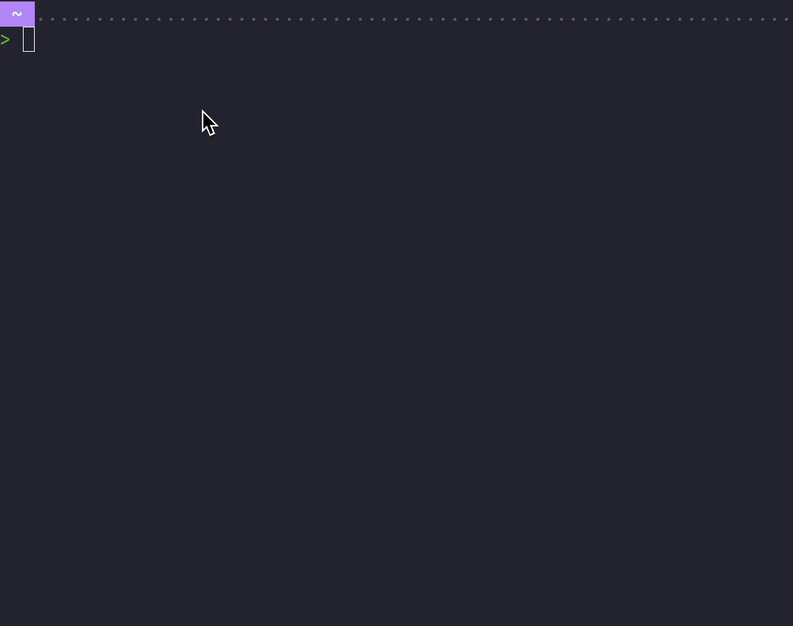

<p align="center">
  
</p>

<h1 align="center">vcser</h1>

<p align="center">
  <a href="README.md">English</a> · <a href="README.zh-CN.md">简体中文</a>
</p>

`vcser` helps you sync extensions across VS Code-based editors on the same machine.

The main experience is the CLI: fast, local, and focused on getting one editor aligned with another without extra setup.



## Why vcser

- Sync extensions between VS Code-based editors locally
- Keep the workflow simple with an interactive CLI
- Build on a shared core that can power more than one interface

## Quick Start

Requirements:

- Node.js `>=22.13`

```bash
npx vcser
```

Or install it globally:

```bash
npm install -g @vcser/cli
vcser
```

That launches the `vcser` CLI wizard.

If you only want the command help:

```bash
vcser --help
```

## Packages

- `packages/cli`: the primary way to use `vcser` today
- `packages/core`: shared runtime logic for editor detection, sync, and persistence

## Desktop Beta

The desktop app is currently in beta. Stay tuned.
